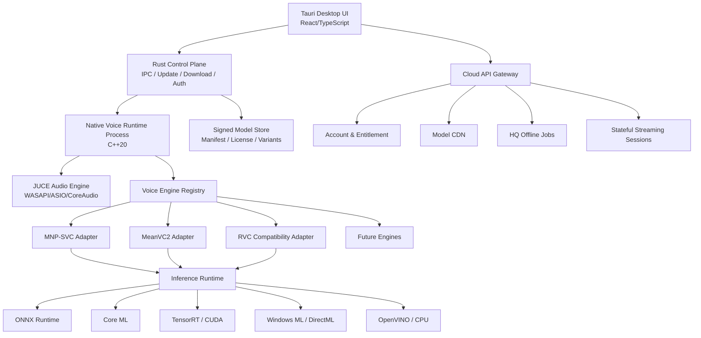

# 《AI Voice Studio 技术立项与架构设计 V1.0》

> 文档状态：技术立项评审稿  
> 日期：2026-08-19  
> 目标平台：Windows 10/11 x64、Windows 11 ARM64（后续）、macOS Apple Silicon；Intel Mac 仅兼容性支持  
> 产品形态：面向消费者的本地优先、可云端增强的 AI 歌声转换与实时 AI 演唱桌面软件  
> 说明：许可证判断是工程风险分析，不替代正式法律意见；上线前须由律师对代码、权重、训练数据和声音权利分别复核。

---

## 0. 执行摘要与立项结论

### 0.1 结论

项目技术上可立项，但不应把任何一个现有开源仓库直接包装成商业产品。正确路线是建设一个产品自有的、原生跨平台的音频与推理 Runtime，把 MNP-SVC、MeanVC2、RVC 等视为可替换的“模型引擎适配器”，而不是产品架构本身。

推荐的产品技术栈：

- **桌面层：Tauri 2 + React/TypeScript**，负责现代消费级 UI、商城、账号、设置、下载、诊断和更新。
- **控制面：Rust**，负责进程生命周期、IPC、模型包、下载校验、权限边界、更新和崩溃恢复。
- **实时数据面：C++20 + JUCE（商业许可证）**，负责 WASAPI/ASIO/CoreAudio、实时线程、重采样、Ring Buffer、时钟同步和后处理。
- **AI Runtime：C++20 稳定 C ABI + ONNX Runtime C API**，以模型插件/适配器承载不同引擎；不把 Python 交付给最终用户。
- **加速后端：Windows ML/ONNX Runtime 为基线，RTX 增加 TensorRT/CUDA 优化包；macOS 以 Core ML 为首选、ORT CoreML/CPU 为回退；Intel 设备增加 OpenVINO。**
- **云端：区域化有状态实时会话 + 异步高质量任务**，仅作为本地能力的增强和兜底，不作为默认必需路径。

核心引擎决策：

| 项目 | 商业产品定位 | 决策 |
|---|---|---|
| MNP-SVC | 高质量歌唱转换 | **继续重点投入，但只作为高质量 SVC 候选，不作为唯一主引擎。** 必须完成原生化、流式状态化和跨平台一致性验证后才能晋级生产。 |
| MeanVC2 | 低配置/零样本实时转换 | **并行验证，暂列实验引擎。** 流式设计有价值，但歌唱、极端 F0、长时稳定性尚未达到产品证据标准；许可证文件还需补齐。 |
| VCClient | 产品与兼容性参考 | **只借鉴设计思想，不派生主产品。** Python 服务、浏览器音频链和历史兼容层不适合作为新商业产品核心。 |
| babiniku.rs | 原生 Rust 推理与实时框架参考 | **作为重要技术样本和验证加速器，不直接作为生产 Runtime。** 其规模、总线因子、分叉 Candle 依赖和歌唱覆盖仍不满足主干要求。 |
| RVC | 用户存量模型兼容、市场冷启动 | **兼容适配器，不作为下一代核心。** |
| DDSP-SVC | 轻量歌唱、F0/相位/DSP研究 | **保留技术价值，适合作为降级或特定音色引擎候选。** |
| LLVC | 极低资源 CPU 语音模式 | **基准/专项模式候选，不承担高质量歌唱。** |
| Seed-VC | 零样本与高质量离线基准 | **研究与云端隔离评估；不链接进闭源客户端。** 官方代码 GPL-3.0 且仓库已归档。 |
| X-VC | 下一代零样本流式语音 | **技术观察与原型验证。** 论文结果很强，但发布时间新、歌唱证据不足。 |

### 0.2 立项的四条硬原则

1. **音频实时线程永不等待 AI。** Callback 内禁止内存分配、锁、文件/网络 I/O、日志和模型推理。
2. **流式不是“把离线模型切成块”。** 所有实时引擎必须显式定义跨块状态、上下文、延迟和重置语义。
3. **模型是数据产品，不是裸权重。** 模型包必须包含兼容性、许可证、声音授权、版本、后端变体、哈希和撤销信息。
4. **改歌词路径以用户实唱波形为唯一内容真值。** 不允许 ASR、原歌词、TTS 或自动代唱替换用户实际唱出的音素、节奏与表达。

### 0.3 Go / No-Go 条件

进入公开 Beta 前必须同时满足：

- 两个生产引擎通过 48 kHz 连续 8 小时运行，无崩溃、无内存持续增长、无不可恢复状态漂移。
- 推荐硬件上端到端 p95 延迟不超过 120 ms；轻量模式 p95 不超过 100 ms。
- Windows 与 macOS 均实现无 Python、无开发工具、无环境变量的签名安装。
- 每个随产品分发的代码组件、模型权重和训练数据均有独立 SBOM/MBOM 与可审计授权记录。
- “用户改词实唱”盲测中，输出音素内容与用户实唱一致，不回退到原歌词或生成文本。
- 自动模式选择在硬件矩阵中错误推荐率低于 5%，且任何失败都能安全回退。

---

## 1. 产品边界与能力模型

### 1.1 产品不是单一 Voice Changer

产品应拆成四条相互复用、但调度和质量目标不同的工作流：

1. **Live Convert：** 麦克风实时转换、耳机监听、录制和直播输出。
2. **Studio Convert：** 文件级声音转换，允许更大上下文、更慢推理、分段重算和人工编辑。
3. **AI Singer：** 歌曲/伴奏、歌词、旋律或参考唱段驱动的完整歌曲生产。
4. **Sing My Lyrics：** 用户按原旋律唱新歌词，系统只更换音色，保留用户真实音素、F0、节奏、气口和表达。

Live Convert 与 Studio Convert 共用 VoiceEngine 接口，但配置、缓存和错误恢复策略不同。AI Singer 是编排管线，不应伪装成一个实时 VoiceEngine。

### 1.2 四种运行模式的产品化定义

| 模式 | 典型硬件 | 默认引擎策略 | 用户承诺 | 目标 |
|---|---|---|---|---|
| 高质量实时 | Apple Silicon M 系列、RTX 20 系以上且显存充足 | 高质量 SVC/VC + FP16/Core ML/TensorRT | 音质优先且可实时监听 | p50 ≤ 80 ms，p95 ≤ 120 ms |
| 轻量实时 | 普通四核 CPU、集显、较老 GPU | MeanVC2/LLVC/量化模型候选 | 保持连续与可懂度，适度牺牲细节 | p50 ≤ 60 ms，p95 ≤ 100 ms |
| 本地离线高质量 | 任何满足最低内存的设备 | MNP-SVC 高质量配置或未来扩散/Flow 引擎 | 允许等待，输出可重现 | RTF ≤ 0.5，推荐设备 ≤ 0.25 |
| 云端 | 本地不满足、用户主动选择或高质量任务 | 云 GPU 有状态流式/离线集群 | 明示网络、隐私、费用和地区 | 实时 RTT 合格才启用；否则仅离线 |

云端不应因为“本地跑不动”就无提示上传麦克风。切换云端必须取得明确同意，并展示延迟、预计流量、隐私与费用。

### 1.3 “改歌词实唱”的不可破坏约束

此场景的正确数据路径是：

```text
用户新歌词实唱波形
  → 去噪/增益/可选人声干声处理
  → 内容特征 + External F0 + 能量/清浊/表达特征
  → 目标音色转换
  → 后处理/混音
```

原歌曲、原歌词和新歌词只能用于：伴奏、提词、时间轴显示、录音对齐、发音提示和质量检查。它们不能成为转换输出的内容源。实现中应设置以下强制门禁：

- VoiceEngine 的实时/文件转换接口不接受歌词作为生成条件。
- ASR 只做旁路校验，绝不回写内容 token。
- 任何“补字、纠音、自动生成”必须是用户显式开启的独立功能，并产生新版本而非覆盖实唱结果。
- 测试集必须包含同旋律、原词/改词最小对照，验证输出内容跟随实唱而非参考歌曲。

### 1.4 AI 代唱不是普通 SVC

“歌曲 + 歌词 + 目标声音 → 完整歌曲”至少包含：

- 人声/伴奏分离或用户提供伴奏；
- 歌词音素化、语言/方言前端；
- 旋律、音符、F0、节拍和音素时长对齐；
- 歌唱合成（SVS）或先生成 guide vocal；
- 目标音色渲染/转换；
- 呼吸、辅音、颤音、力度和情绪控制；
- 混音、响度、母带和导出。

因此 AI Singer 应是独立的 `SongProject` 编排域，复用模型仓库、离线调度器、音频 I/O 和目标音色，但不应挤进实时 VoiceEngine ABI。首个六个月版本应先完成“用户提供干声/实唱 → 目标声音”，将全自动 SVS 放在后续阶段或云端。

---

## 2. 总体架构



### 2.1 进程边界

| 进程 | 职责 | 崩溃影响 | 权限 |
|---|---|---|---|
| `voice-studio` | Tauri 窗口、业务 UI、用户操作 | UI 可重启；录音 Runtime 可短时继续 | 普通用户权限 |
| `voice-runtime` | 音频设备、实时调度、模型推理、录制 | 自动停止/旁路并由 watchdog 拉起 | 普通用户权限；不开放公网监听 |
| `voice-updater` | 原子更新、回滚、签名验证 | 不影响当前会话 | 仅安装/更新时提升权限 |
| 虚拟音频设备组件 | 提供系统可选输入端点 | 失败不应阻止物理设备监听 | Windows 驱动/macOS 系统扩展需签名与单独安装 |

UI 与 Runtime 通过本机认证 IPC 通信：控制消息使用版本化 RPC；电平、波形和指标使用共享内存的只读遥测区；实时 PCM 不穿越 WebView，也不经 JSON 序列化。

### 2.2 故障隔离

- AI 模型加载失败：回退上一个已验证模型或 Dry Monitor，不让音频设备悬挂。
- UI 崩溃：Runtime 保存当前录音并在有限时间内继续，重新连接后恢复状态。
- Runtime 崩溃：音频设备释放，虚拟输出进入静音/旁路；生成最小化崩溃包。
- GPU 驱动复位/设备丢失：销毁会话，在冷备 CPU 引擎上恢复；不要在 Callback 内重建。
- 模型更新失败：内容寻址目录 + 原子指针切换，旧模型保留到新模型通过自检。

---

## 3. A. Desktop Application Layer

### 3.1 框架评估

| 方案 | 优点 | 主要问题 | 结论 |
|---|---|---|---|
| **Tauri 2** | 安装体积和常驻内存相对低；Rust 控制面安全；使用系统 WebView；现代 UI 与商城开发效率高；MIT/Apache 生态 | Windows WebView2 与 macOS WKWebView 有细微差异；不适合承载实时 PCM；需管理 Rust/C++ IPC | **首选桌面壳** |
| Electron | 前端生态成熟、渲染一致、团队招聘容易 | 自带 Chromium/Node，多进程与内存/安装体积更高；攻击面和更新压力更大；对音频核心仍需原生进程 | 仅在前端团队完全无法承担 Tauri 时作为备选。Electron 官方说明其继承 Chromium 多进程模型。[来源](https://www.electronjs.org/docs/latest/tutorial/process-model) |
| JUCE | 专业音频设备、MIDI、插件和 DSP 生态成熟；单一 C++ 进程性能好 | 复杂消费级商城/账号 UI 开发慢；视觉迭代成本高；闭源分发需购买 JUCE 许可证或遵守 AGPLv3。[来源](https://juce.com/get-juce/) | **用于 Audio Engine，不用于主 UI** |
| Flutter | UI 一致、动效好、跨平台效率高 | 桌面专业音频/驱动生态弱；Dart 与原生实时链仍需 FFI；包体和可访问性细节需额外投入 | 不选 |
| Qt/QML | C++ 集成成熟、桌面能力强、跨平台稳定 | QML/模块学习成本、部署与 LGPL/commercial 合规复杂；部分模块授权不同。[来源](https://doc.qt.io/qt-6/licensing.html) | B 计划；适合纯 C++ 团队，不是本项目首选 |

### 3.2 Tauri 层职责

- 首次启动向导与权限说明；
- 设备、模型、模式和声音选择；
- 实时电平、延迟、负载、丢帧与状态展示；
- 录音工程、时间线、A/B、导入导出；
- 模型下载、安装、升级、卸载、授权与商城；
- 账号、订阅、配额、云任务和同步；
- 诊断包预览与用户授权上传；
- 自动更新、回滚提示和版本说明。

Tauri 层不得：直接打开低延迟音频设备、持有推理 Session、处理实时 PCM、在前端计时器中驱动音频调度。

### 3.3 UX 设计原则

- 默认只展示“推荐模式”，高级用户可展开设备、buffer、后端和音高算法。
- 延迟显示必须是实测端到端估计，不只是模型 inference time。
- 切换模型采用预加载、预热、零点/短交叉淡化切换；加载期间不冻结 UI。
- 所有云功能显示本地/云标识；麦克风上传时有持续可见指示。
- 模型不可用时展示可行动的原因：显存不足、授权失效、驱动不兼容或文件损坏。

---

## 4. B. Audio Engine Layer

### 4.1 实时数据流

```text
Physical/Virtual Input
  → Audio Callback（仅搬运、时间戳、轻量增益）
  → SPSC Input Ring
  → Frame Assembler / Stateful Resampler
  → Deadline Scheduler
  → Feature + F0 + VoiceEngine Inference
  → Stateful Post Processing / OLA / SOLA
  → SPSC Output Ring
  → Audio Callback
  → Monitor / Recorder / Virtual Output
```

设备侧统一优先使用 48 kHz float32；模型可运行于 16/22.05/24/32/44.1/48 kHz，由持久化、高质量流式重采样器处理。任何非整数采样率转换都必须保存滤波器 history 和分数相位。

### 4.2 线程模型

| 线程 | 优先级 | 可做 | 禁止 |
|---|---|---|---|
| Input/Output Callback | OS 实时音频优先级 | 复制预分配帧、打 sample-clock 时间戳、原子计数、极轻量限幅 | 锁、分配、推理、日志、磁盘、网络、等待 |
| Audio Coordinator | 高 | 组帧、重采样、环形队列水位、时钟漂移校正 | 不可阻塞在 UI/网络 |
| Inference Worker | 高但低于 callback | 特征、F0、模型执行、状态提交 | 不直接操作设备；超时必须可取消/丢弃结果 |
| Post Worker | 高 | OLA/SOLA、去咔哒、响度、混合、PLC | 不修改未提交模型状态 |
| Recorder | 正常 | 顺序写临时容器、定期 fsync、崩溃恢复 | 不阻塞实时队列 |
| Telemetry/UI | 低 | 聚合 p50/p95/p99、每秒采样 UI | 不读取实时大块 PCM |
| Model Loader | 低 | 校验、加载、预热、构建 TensorRT/Core ML cache | 不与实时 Session 抢满 GPU；加载需限速 |

推理至少使用双上下文：Active Session 服务当前音频，Standby Session 用于新模型预热或故障回退。状态切换只发生在块边界，使用 generation ID 防止旧结果写入新会话。

### 4.3 数据结构

- `AudioBlock`：固定容量、64 字节对齐、planar float32、样本数、通道数、单调 sample index、设备时间戳、discontinuity flag。
- `SpscRing<AudioBlockHandle>`：单生产者单消费者、无锁、容量为 2 的幂；Block 来自启动时分配的池。
- `FrameWindow`：`left_context + current + right_lookahead` 的逻辑视图，尽量避免复制。
- `InferenceTicket`：deadline、stream generation、model revision、input range、state snapshot ID。
- `StreamState`：引擎私有 opaque state + Runtime 公共状态；只允许在成功推理后原子提交。
- `TelemetryFrame`：水位、xrun、deadline miss、RTF、CPU/GPU/内存、设备漂移、状态重置原因。

### 4.4 Buffer 与背压

不要用一个“大 buffer”掩盖抖动。应分开定义：

1. 设备周期 buffer；
2. 输入安全水位；
3. 模型 hop/chunk；
4. 模型 lookahead；
5. 输出 jitter buffer。

实时策略优先“保持当前”而不是“完整处理过去”：

- 推理超过 deadline 时，不允许队列无限增长；丢弃尚未推理的最旧输入直到追上实时线。
- 丢块后生成 discontinuity，清理不安全的模型 cache，并用 5–20 ms 等功率交叉淡化连接。
- 短缺口使用最近有效尾部的衰减/噪声形状 PLC；长缺口切 Dry 或静音，不能重复波形造成嗡鸣。
- 高水位逐级触发：减少可选后处理 → 降低模型质量档 → 增大一次 chunk（只在允许增加延迟时）→ 切备用引擎。
- 低水位不通过随机睡眠修正；用设备时钟估计与异步重采样做 ppm 级漂移补偿。

### 4.5 防爆音、丢帧和同步

- 所有模型切换、reset、设备切换和错误恢复使用短交叉淡化。
- OLA 窗必须满足 constant-overlap-add；SOLA 搜索只在限定范围，并保存前一输出尾部。
- 监控、录制、直播输出共享主 sample clock 和时间戳，不各自重新计时。
- 录制原始输入、转换输出、伴奏为独立 stem；导出时基于 sample index 对齐。
- 为 OBS/视频提供精确算法延迟元数据和可配置音视频补偿。
- 自动测试 click、chirp、impulse、静音到强音、清浊切换和设备热插拔。

### 4.6 虚拟音频设备

JUCE 能处理设备，但不能替代可分发的虚拟驱动。商业产品若希望在 OBS、Discord、直播软件中直接出现“AI Voice Studio Microphone”，需要：

- Windows：虚拟音频驱动、EV 代码签名、WHQL/Attestation 签名、安装/卸载/升级/崩溃恢复；ASIO 仅用于专业设备，不是消费者通用输出。
- macOS：AudioServerPlugIn 或适用的系统扩展方案、Developer ID、Notarization、权限和 OS 兼容测试。

建议 MVP 先兼容用户已有虚拟线缆并提供物理监听；Phase 6 再发布自有虚拟设备。驱动应是独立可选组件，失败不能阻塞主应用安装。

---

## 5. C. AI Runtime Layer

### 5.1 统一接口不是五个函数，而是一份能力合同

建议对外暴露稳定 C ABI，内部 C++ 封装。`VoiceEngine` 生命周期语义：

| 操作 | 语义 |
|---|---|
| `enumerateCapabilities` | 返回支持的采样率、chunk、lookahead、F0 来源、speaker 模式、精度和后端 |
| `initialize` | 建立 Runtime 上下文、分配上限内存、绑定后端和线程，不加载用户模型 |
| `loadModel` | 验证 manifest、权重、状态 schema 和后端变体，建立不可变 Session |
| `prepareStream` | 按 stream config 预分配状态并预热；返回精确 algorithmic latency |
| `process` | 输入带 sample range 的连续块和显式 state；返回输出、下一状态、质量/超时标志 |
| `flush` | 文件/停止场景排空尾部；实时设备丢失时不得无限等待 |
| `reset` | 明确 reset 原因；清除模型与 DSP history，generation 递增 |
| `snapshot/restore` | 仅支持的引擎用于热切换或恢复；状态版本必须匹配 |
| `unload/release` | 在非实时线程释放资源，支持超时与强制进程回收 |

### 5.2 核心类型

- `EngineDescriptor`：engine ID、semver、ABI、功能标签（singing/speech/zero-shot/trained）、许可证策略。
- `ModelManifest`：模型格式、engine 兼容范围、输入输出、F0 语义、speaker 信息、后端变体、权重权利、量化和哈希。
- `StreamConfig`：I/O rate、model rate、chunk/hop、left/right context、quality tier、latency ceiling。
- `ExternalFeatures`：F0、uv、energy、content features；必须带 hop 和 sample alignment，不允许“同长度即认为对齐”。
- `ProcessResult`：输出 sample range、真实耗时、deadline、状态版本、recoverability、警告。
- `EngineState`：opaque bytes 不够；必须有 schema ID、revision、device/backend affinity 和可重置级别。

### 5.3 插件策略

第一年不开放任意第三方原生插件。只允许公司签名的引擎动态库，防止任意 DLL/dylib 进入录音权限进程。模型商城出售的是受 schema 约束的模型包，不是执行代码。

后续若开放第三方引擎：

- 优先进程外 sandbox worker；
- 使用稳定 C ABI，不暴露 STL/Rust ABI；
- 每个插件声明最大内存、实时预算、网络/文件权限；
- watchdog、熔断、签名、撤销与最小版本门禁；
- GPL/非商业组件不能通过“插件”形式规避合规评估。

### 5.4 模型包

建议扩展名 `.avsmodel`，本质为签名、内容寻址的不可变包：

```text
manifest.json
rights.json
signature.ed25519
assets/avatar.webp / preview.opus
variants/
  ort-cpu/model.ort
  winml/model.onnx
  tensorrt-rtx/model.onnx + profiles.json
  coreml/model.mlpackage
  openvino/model.xml + model.bin
calibration/
  test_vectors/
  expected_metrics.json
```

`rights.json` 至少记录：代码来源与许可证、权重许可证、训练数据授权类别、声音主体同意/合同 ID、商业地域、期限、允许用途、撤销策略、生成内容标识要求。加密只能降低随手复制，无法保证本地模型绝不提取；真正高价值且不可下发的模型应仅在云端运行。

---

## 6. D. Inference Backend Layer

### 6.1 总体策略

以 ONNX 作为首要交换格式、ONNX Runtime 作为通用 Runtime，但不追求“一份 ONNX 在所有硬件表现一致”。产品需要同一逻辑模型的多个经过验证的后端变体。ONNX Runtime 的 Execution Provider 机制允许把受支持子图分配到 CUDA、TensorRT、DirectML、CoreML、OpenVINO 等后端，并按优先级回退。[官方说明](https://onnxruntime.ai/docs/execution-providers/)

### 6.2 平台矩阵

| 平台/硬件 | 首选 | 次选 | 最终回退 | 备注 |
|---|---|---|---|---|
| Windows 11 24H2+ RTX | Windows ML 的 NVIDIA EP 或产品验证后的 TensorRT RTX/ORT TensorRT | ORT CUDA | ORT CPU | Windows ML 可管理硬件 EP；TensorRT 需严格版本与 cache 管理 |
| Windows 10/11 RTX | ORT TensorRT（固定模型 shape） | ORT CUDA | ORT CPU | 不能要求用户安装 CUDA Toolkit；产品随包或使用兼容 redistributable，用户只需合格驱动 |
| Windows AMD/Intel GPU | Windows ML 厂商 EP | DirectML | ORT CPU/OpenVINO CPU | DirectML 已进入 sustained engineering，新开发转向 Windows ML。[官方说明](https://onnxruntime.ai/docs/execution-providers/DirectML-ExecutionProvider.html) |
| Windows Intel CPU/iGPU/NPU | Windows ML OpenVINO EP / OpenVINO | ORT CPU | 轻量云端 | NPU 是否可用必须实际编译/执行探测 |
| macOS Apple Silicon | 原生 Core ML 模型 | ORT CoreML EP | ORT CPU | 对 stateful/dynamic op 做逐模型验证；ANE 不一定适合所有音频图 |
| Intel Mac | ORT CPU/CoreML | — | 云端/离线 | 不承诺高质量实时；控制支持范围 |

Windows ML 当前由 ONNX Runtime 驱动，可通过 Windows 管理适合 GPU/NPU 的执行提供程序；自包含部署约 41 MB 并可固定版本，框架依赖模式则由系统维护。[概览](https://learn.microsoft.com/en-us/windows/ai/new-windows-ml/overview) [部署](https://learn.microsoft.com/en-us/windows/ai/new-windows-ml/distributing-your-app) 这使它适合成为长期 Windows 统一入口，但首发仍需保留自带 ORT CPU 和已验证 GPU 包，避免系统组件/驱动差异造成全量不可用。

OpenVINO 支持 CPU、GPU 和 NPU，并提供自动设备选择与异构执行，适合 Intel 硬件和 CPU 优化；GPU/NPU 仍依赖合格驱动。[官方设备说明](https://docs.openvino.ai/2025/documentation/compatibility-and-support/supported-devices.html)

### 6.3 TensorRT、CUDA、DirectML/Windows ML 的取舍

- **TensorRT：** RTX 上可能提供最低延迟；适合固定 shape、固定 chunk 的热路径。代价是模型构建耗时、动态 shape profile、版本/驱动组合和 cache 失效。必须预热并缓存 engine；构建发生在非实时线程。ORT 官方说明 TensorRT cache 可把 Session 初始化从分钟降至秒级。[来源](https://onnxruntime.ai/docs/execution-providers/TensorRT-ExecutionProvider.html)
- **CUDA EP：** 操作覆盖通常比 TensorRT 稳定，性能好，是 RTX 的可靠 B 方案；仍需管理 CUDA/cuDNN ABI 和包体。
- **Windows ML：** 长期首选 Windows 统一入口，能通过系统提供的厂商 EP 覆盖 GPU/NPU，但它只负责 EP 分发，不替代模型优化和硬件矩阵测试。
- **DirectML：** 广覆盖保底，不应作为唯一高性能保证；尽量固定 tensor shape，避免 CPU/GPU 频繁回退和复制。
- **CPU EP：** 永远保留，支持诊断、低配和安全回退；使用线程亲和性、内存 arena、INT8/FP16（硬件合适时）和固定 shape 优化。

### 6.4 Core ML 与 Metal

macOS 不建议自行写 Metal 神经网络算子作为第一代主路线。优先把可支持子图转换为 Core ML，让系统选择 CPU/GPU/ANE；无法转换的模型使用 ORT CPU 或单独重构。需要特别测试：

- 动态时间维、KV cache/state tensor；
- STFT/iSTFT、GridSample、归一化和自定义激活；
- ANE/GPU 切换造成的首次运行抖动；
- FP16 对 F0、相位和 vocoder 的听感偏差；
- macOS 版本之间编译 cache 与数值差异。

Metal 仅用于明确的自定义 DSP/GPU 算子或 Core ML 无法覆盖且收益足够大的热点，不让平台专用代码扩散到 Engine 接口。

### 6.5 ONNX Runtime、Core ML、ExecuTorch、Candle 的平台级比较

| 技术 | 优势 | 缺点 | 决策 |
|---|---|---|---|
| ONNX Runtime | 成熟 C/C++ API、广泛 EP、跨平台、工具与运维生态完整 | 音频模型导出可能遇到动态控制流/自定义算子；不同 EP 结果不完全一致 | **默认统一 Runtime** |
| 原生 Core ML | Apple 平台能效与系统集成最好 | 仅 Apple；转换和算子覆盖需专门版本 | **macOS 优化变体** |
| TensorRT | NVIDIA 极致性能 | 构建、版本、shape、包体和 cache 运维成本高 | **RTX 高性能变体** |
| ExecuTorch | PyTorch Edge 路线、AOT、桌面/多后端正在扩展 | 通常需为后端生成独立 `.pte`；音频模型与算子需逐项验证，当前桌面产品成熟度低于 ORT | 观察与专项 PoC，不做 V1 主 Runtime。官方也建议按后端生成专用文件。[来源](https://docs.pytorch.org/executorch/stable/backends-overview.html) |
| Candle | 纯 Rust、部署简洁、可直接实现特殊模型 | 模型需手写/移植，算子、图优化、量化、生产诊断生态较小；容易形成内部维护分叉 | 用于研究性原生端口或无法导出的小模型，不作为全局抽象 |

### 6.6 Python 模型产品化流水线

```text
Research PyTorch checkpoint
  → 冻结前处理/F0/特征/声码器的精确定义
  → 导出 ONNX（state 显式输入输出、固定候选 shape）
  → 图清理/常量折叠/算子替换
  → FP32 golden parity
  → FP16/INT8 感知与听感验证
  → 生成 ORT / Core ML / TensorRT / OpenVINO 变体
  → 真实音频与极端测试向量验证
  → 性能/内存/连续性认证
  → 签名模型包和灰度发布
```

验收不是“ONNX 能跑”：波形误差、F0 偏差、周期/相位连续性、说话人相似度、内容一致性、长时状态漂移和听感 ABX 都必须通过。导出工具可使用 Python，但最终用户安装包不得依赖 Python。

---

## 7. 现有项目的商业底座评估

评估依据截至 2026-08-19 的公开仓库状态。Star 数不等于工程质量，只作为社区规模信号。

### 7.1 MNP-SVC

[MNP-SVC](https://github.com/TylorShine/MNP-SVC) 是 MIT 许可、以 PyTorch 为主的歌唱转换项目，公开说明实时前端使用 sliding window、cross-fade、SOLA 和 contextual semantic reference，并提供 ONNX 导出，但当前说明仍称 ONNX 仅支持 CPU。

**技术价值：**

- 为歌唱建立的 External F0、清浊处理、相位/谐波源和声码器路径，和本产品“保留音高、颤音、滑音、表达”的目标直接一致。
- 已验证的歌唱细节优于把通用语音 VC 生硬用于歌唱。
- MIT 代码许可相对友好，模型体积和训练方式具备本地化潜力。

**不适合直接成为商业主引擎的原因：**

- 实时实现仍是 Python GUI 和窗口拼接思路，不等于可证明的 stateful streaming。
- 上下文、相位、声码器尾部、F0 tracker 和 reset 行为没有产品级 ABI。
- ONNX 支持范围与 GPU/macOS 路径不足；依赖的预训练编码器、F0 模型、speaker encoder、vocoder 权重必须分别审计。
- 项目维护与社区规模较小，单一维护者风险高。

**决策：继续作为高质量歌唱引擎候选，但要“重新产品化”，不是嵌入 Python。** Phase 1/2 必须完成：模型图拆解、所有依赖权利清单、C++ 推理、显式 streaming state、跨块 golden test、Windows/macOS 性能和 8 小时 soak。若达不到 p95 延迟/连续性门槛，它仍可作为本地离线高质量引擎，而实时主位交给其他模型。

### 7.2 MeanVC2

[MeanVC2](https://github.com/ASLP-lab/MeanVC2) 主打低延迟流式零样本 VC，README 声称 40 ms chunk 下端到端 pipeline latency 约 110 ms，并展示 Future-Receptive Chunking、UTTE 和 KV cache 相关实现。

**适合作为低配置模式候选的理由：**

- 从模型设计起考虑 streaming，而不是纯离线窗口包装。
- 零样本音色条件有利于用户快速试用和商城预览。
- Apache-2.0 的声明方向适合商业集成。

**当前不能直接晋级生产的原因：**

- 项目非常新，长时运行、设备抖动、极端输入和跨平台端口证据不足。
- 公开指标主要针对语音；歌唱中的宽 F0、长元音、颤音、强弱声、辅音瞬态和高采样率空气感尚需独立验证。
- README 声称 Apache-2.0，但仓库根目录当前没有 LICENSE 文件且 GitHub API 无法识别许可证。商业采用前必须补齐明确许可证或取得书面授权。
- Python/Torch Runtime 不符合消费者安装要求。

**决策：** 作为“轻量实时/零样本预览”候选并行验证，不先承诺歌唱。先做 200 首/多音域歌唱基准和原生端口可行性；通过后再进入模型矩阵。

### 7.3 VCClient / w-okada Voice Changer

[VCClient](https://github.com/w-okada/voice-changer) 是成熟的多模型实时变声产品参考，仓库包含 React/TypeScript client、音频 worklet、Python server、REST/Socket.IO、ModelSlot/Manager、多种 voice changer adapter 和跨平台发行经验。

**值得借鉴：**

- `ModelSlot` / manager 的“模型槽位 + 多引擎统一管理”产品心智；
- 多模型适配、模型信息探测和动态设置结构；
- 浏览器/本地/远端 server 的控制通道分离；
- 音频设备枚举、输入输出选择、buffer 调整、server/client 性能展示；
- UI 按模型能力显示参数，而非硬编码一个模型；
- 大规模真实用户暴露出的驱动、AMD/NVIDIA、虚拟线缆和安装问题，可作为测试需求库。

**不应直接采用：**

- Python 推理 server、Socket.IO/REST 进入本机热路径，增加复制、序列化、端口和故障面；
- WebAudio/worklet 适合浏览器客户端，不应负责原生桌面最低延迟链路；
- 多年叠加的模型兼容分支和 UI 参数会形成“技术参数面板”，不适合普通消费者；
- 仓库级 MIT 不自动覆盖所有随附模型、第三方代码和下载权重；
- 代码结构更偏开源聚合工具，而非带账号、授权、商城、签名包、灰度更新与遥测的商业平台。

**决策：** 建立“VCClient lessons learned”测试清单，可借鉴抽象思想和符合许可的局部实现，但不 fork 成产品主线。

### 7.4 babiniku.rs

[babiniku.rs](https://github.com/m96-chan/babiniku.rs) 是 MIT/Apache-2.0 的纯 Rust 实时零样本 VC 工具，已经形成 `vc-core`、MeanVC、X-VC、Seed-VC、CosyVoice、Vevo、平台音频和模型 fetcher 等 crate，并明确区分 GPL Seed-VC feature。它证明了“无 Python、Rust/Candle/ORT、跨平台音频、模型适配器”的方向可行。

**值得吸收：**

- engine-agnostic trait 与一个 crate 一个引擎的边界；
- 纯原生模型权重转换、golden tests、每模型文档和差异记录；
- GPL 引擎 feature-gate 及构建产物可审计的意识；
- 48 kHz 设备侧、模型采样率转换、虚拟麦和清理恢复经验；
- 把 streaming bug 当成独立系统问题而非只看离线音质。

**为什么不直接作为未来底层 Runtime：**

- 截至调研时社区规模极小，生产总线因子和外部验证不足；
- 使用维护者自己的 Candle 分支，形成关键推理依赖的供应链与维护风险；
- 音频设备层依赖 cpal/WASAPI/CoreAudio/Pulse 的组合，专业 ASIO、复杂聚合设备、驱动签名和消费级诊断能力还需建设；
- 当前引擎主要是语音零样本，仓库 issue 也明确歌唱仍是缺口；
- 其 Seed-VC feature 会使相应分发 binary 进入 GPL-3.0 约束，不能混入闭源版本。

**决策：** 作为“参考实现 + 端口验证台”，逐项复用经法律和测试批准的思想/代码；产品 Runtime 仍由自身 C ABI、JUCE 音频层和受控 ORT 后端构建。若 6–12 个月后其稳定性、维护与歌唱覆盖显著提升，可重新评估部分 crate。

### 7.5 RVC

[RVC](https://github.com/RVC-Project/Retrieval-based-Voice-Conversion-WebUI) 代码 MIT、社区和用户模型存量巨大，训练数据需求低，F0 路径对歌唱实用。

- **适用：** 存量模型导入、用户迁移、快速训练、离线翻唱和中配实时兼容。
- **技术价值：** retrieval/index、speaker-specific 小模型、成熟 F0 工具链和广泛真实硬件经验。
- **风险：** Python/FAISS/PyTorch 工具链复杂；社区模型授权普遍不可验证；实时路径多为滑窗拼接；模型格式碎片化；音质/泄漏/噪声取决于数据。
- **决策：** 只提供隔离兼容层和“导入前权利声明”，官方商城不接受来源不明模型。新训练默认转向公司自有格式。

### 7.6 DDSP-SVC

[DDSP-SVC](https://github.com/yxlllc/DDSP-SVC) 为 MIT，明确面向实时歌唱，并采用 sliding window、cross-fade、SOLA、上下文语义参考；可结合预训练 vocoder 或浅扩散增强。

- **适用：** 轻量歌唱、低算力、F0 可控、特定音色；也可作为 MNP 的架构对照。
- **技术价值：** 谐波/噪声源、显式 F0、资源效率、歌唱数据处理和实时拼接经验。
- **风险：** 增强器会增加复杂度和延迟；Python 部署；极端清浊/相位/高频可能出现金属感；依赖权重需逐项审计。
- **决策：** 技术储备与可选轻量 SVC，不作为默认旗舰音质。

### 7.7 LLVC

[LLVC](https://github.com/KoeAI/LLVC) 为 MIT，目标是 CPU 上低延迟、低资源语音转换，其论文/实现偏因果流式语音。

- **适用：** 极低配 CPU、会议/游戏语音、实时故障回退。
- **技术价值：** 因果网络、蒸馏、确定的低资源预算、可作为最低端硬件基准。
- **风险：** 仓库主要停留在 2023 年研究代码；歌唱质量、目标音色表现和高采样率有限；模型生态小。
- **决策：** CPU baseline/备用引擎，不承担高质量实时演唱。

### 7.8 Seed-VC

[Seed-VC](https://github.com/Plachtaa/seed-vc) 支持零样本语音、歌唱和实时演示，质量和少样本适配有研究价值。

- **适用：** 高质量离线、云端零样本、竞品质量基准、未来用户定制。
- **技术价值：** diffusion transformer/flow matching、reference conditioning、语音与歌唱统一建模。
- **商业风险：** 官方仓库 GPL-3.0 且已归档；实时算法延迟公开约 300 ms 加设备侧约 100 ms，不适合低延迟监听；依赖 Whisper/CAM++/BigVGAN 等权重需分开审计。
- **决策：** 不链接进闭源桌面；可作为内部研究基准，或在严格隔离、完成法律评估后用于云服务。若要产品化，应独立训练可授权模型并重写实现，不能把“重写”误认为自动摆脱模型/数据权利。

### 7.9 X-VC

[X-VC](https://arxiv.org/abs/2604.12456) 是 2026 年的 codec-space 一步式零样本流式 VC。论文报告较强的中英语音内容与说话人相似度、离线 RTF 0.014，并采用 chunkwise streaming + overlap smoothing。

- **适用：** 下一代零样本语音实时、跨语言预览、云/本地高性能候选。
- **技术价值：** 在 codec latent 做一步转换，避免迭代生成；双条件与流式块设计值得跟踪。
- **风险：** 新项目、真实设备与长时证据不足；SAC codec 的窗口/解码连续性需要验证；歌唱未被充分证明；代码/权重和上游 codec 的许可必须逐项确认。
- **决策：** Phase 2 技术雷达与基准项目，不进入首发承诺。

---

## 8. 问题 1：实时 Streaming 连续性

### 8.1 为什么独立 chunk 会断裂

独立处理每个 chunk 会丢失多种连续性：

- **波形相位：** 相同 F0 但起始相位不同，边界产生阶跃和 click。
- **声码器卷积尾部：** causal/non-causal receptive field 被截断，边缘样本质量差。
- **STFT/iSTFT 状态：** analysis/synthesis window 与 overlap 未连续，幅度不满足 COLA。
- **F0 与清浊：** tracker 每块重新估计，边界抖动、八度跳和 uv 闪烁。
- **内容特征：** 编码器缺少左历史/右 lookahead，辅音和连音被切断。
- **生成模型状态：** KV cache、flow/diffusion condition、speaker/context token 被重置。
- **后处理：** 重采样分数相位、滤波器 delay line、响度/降噪状态丢失。

Cross-fade/SOLA 能掩盖部分波形边界，但不能修复内容 token、F0、生成状态本身的错误。因此它是最后一道拼接层，不是 stateful streaming 的替代品。

### 8.2 状态化 Streaming 架构

每个 `VoiceStream` 持有以下状态：

| 状态域 | 内容 | 生命周期 |
|---|---|---|
| Input history | 左上下文 PCM、噪声估计、gate、DC/HPF、resampler delay | 连续流 |
| Feature cache | encoder 卷积 cache、KV cache、内容 token history | 模型定义 |
| Pitch state | F0 tracker、uv、置信度、平滑器、相位累加器 | 连续流 |
| Conditioning | speaker embedding、reference tokens、情绪/风格条件 | 模型或用户切换 |
| Generator state | causal conv tail、decoder/vocoder state、随机数/噪声计划 | 每个流 |
| Output history | OLA tail、SOLA reference、limiter/denoiser/resampler state | 连续流 |
| Timeline | input/output sample index、算法延迟、discontinuity generation | 设备会话 |

处理协议：

1. Scheduler 形成 `history + current + lookahead`，其中只提交 current 对应的中心有效区。
2. Engine 读取状态快照，推理成功才提交 next state；超时/取消不能污染后续状态。
3. 输出裁去模型边缘不可信区，经过 OLA/SOLA 与上一已提交尾部连接。
4. 每个输出块携带精确输入 sample range，录音和 A/V 同步按时间线而非到达时间。
5. discontinuity 根据级别处理：短丢块保留安全 DSP state；设备/模型变化执行完整 reset。

### 8.3 连续性验证

- 将同一长音频分别以离线整段、随机 chunk、不同 callback size 运行，比较中心区域与边界指标。
- 生成固定 F0 长音、chirp、颤音、滑音、清浊交替、爆破音、静音突入和长尾元音。
- 自动检测 sample jump、3 ms RMS spike、谱通量异常、F0 octave jump、DC 偏移和 OLA 增益波动。
- 2/8/24 小时 soak，注入随机 1–50 ms 推理抖动、设备热插拔、sleep/wake、GPU reset。
- 主观 MUSHRA/ABX 重点单独评分“边界可闻性”，不能只看全局 MOS。

---

## 9. 问题 2：跨平台模型运行与无 Python 交付

### 9.1 安装包应包含什么

最终用户只安装签名 `.exe/MSIX` 或 `.dmg/.app`。包内包含：

- Tauri 应用与原生 Runtime；
- CPU 基线推理库；
- 必要的 VC runtime/Universal CRT 等可再发行组件；
- 最小内置模型或首次启动可恢复下载器；
- 后端探测器，不包含 Python/Conda/pip；
- 模型与后端分包，避免所有用户下载数 GB 的 CUDA/TensorRT 资源。

开发侧可以使用 Python 完成训练、导出和验证，但产物进入模型注册表后只允许标准模型格式、数据文件和签名 manifest。禁止在客户端执行模型包中的 Python、shell、动态下载脚本。

### 9.2 供应链

- 依赖锁定、可重现构建、签名、notarization、SBOM、漏洞扫描。
- Windows 代码签名与 macOS Developer ID/notarization 自动化；更新清单使用独立离线根密钥签名。
- Runtime、模型、GPU 后端分开版本和回滚；模型 manifest 声明最小/最大 ABI。
- 所有下载先写 staging、校验哈希与签名、运行自测，再原子激活。
- 本地 cache 有配额、LRU 和引用计数；不能在模型正在运行时删除映射文件。

---

## 10. 问题 3：端到端音频延迟

### 10.1 延迟预算

端到端延迟不是模型推理耗时之和。应以 loopback 测量从输入脉冲到输出脉冲：

| 组成 | 高质量实时目标 | 轻量实时目标 | 控制方式 |
|---|---:|---:|---|
| 输入设备/OS | 3–10 ms | 3–10 ms | WASAPI exclusive/低 buffer、CoreAudio、ASIO 可选 |
| 输入安全 buffer/组帧 | 5–15 ms | 5–10 ms | 固定水位、避免多层缓存 |
| 特征/F0/lookahead | 10–30 ms | 5–20 ms | 因果/有限前瞻模型 |
| AI inference | 10–35 ms | 5–20 ms | 目标硬件 p95，不看平均值 |
| OLA/后处理 | 5–15 ms | 3–10 ms | 最短可靠 overlap |
| 输出 jitter + 设备 | 8–20 ms | 8–20 ms | 自适应但有上限 |
| **总计** | **41–125 ms** | **29–90 ms** | 产品门槛 p95 分别 120/100 ms |

高质量模式在部分设备可能接近上界；若超过 150 ms，不应再称为“低延迟耳返”，应提示改为直播输出或离线。对歌手而言，纯直达耳返可作为可混合的 dry monitor，但必须明确它不是 AI 后声音。

### 10.2 性能指标

- `algorithmic latency`：模型 chunk/lookahead/OLA 导致的理论固定延迟。
- `processing latency p50/p95/p99`：从 frame ready 到 output ready。
- `device round-trip latency`：用 loopback 或驱动时间戳测量。
- `deadline miss rate`、xrun、ring high/low watermark。
- `RTF` 不足以代表实时可用：RTF 0.5 的 1 秒 chunk 仍可能有 500 ms 延迟。

目标：推荐档连续 2 小时 0 xrun；8 小时无可闻爆音；steady-state inference p99 小于 hop deadline；切模型不超过一次 50 ms 可控静音或使用无缝交叉切换。

---

## 11. 问题 4：硬件自动适配

### 11.1 首次启动流程

```text
Consent & Privacy
  → Static Hardware Profile
  → Audio Device Probe
  → Backend Availability Probe
  → Model Microbenchmarks
  → 30–60s Quick Stability Test
  → Capability Profile
  → Recommended Mode + Explanation
  → 可选后台 5 分钟 Thermal/Soak 校准
```

1. `HardwareProfiler` 收集 OS build、CPU/指令集、核心拓扑、内存、GPU/显存、驱动、NPU/EP、磁盘空间和电源状态。
2. `AudioProbe` 枚举设备 API、采样率、通道、buffer 范围、clock domain、默认设备和 loopback 能力；只探测，不擅自切换系统默认设备。
3. `BackendProbe` 创建最小 Session 并实际执行，不相信设备名；记录 op coverage、fallback、冷启动和显存分配。
4. `BenchmarkRunner` 用产品真实子图与完整轻量模型测 warm p50/p95/p99、RTF、内存、GPU、CPU、功耗/温度可得性。
5. `StabilityProbe` 注入连续音频、切换清浊和短抖动，观察 deadline miss 与 cache 增长。
6. `ModeSelector` 使用版本化规则和置信度选择模式，并说明原因；用户可覆盖，失败自动回退。

### 11.2 Capability Profile

Profile 是本地版本化 JSON，包含：

- 匿名机器配置哈希、采集时间、OS/驱动/应用/Runtime 版本；
- 设备列表与稳定 ID，不保存麦克风内容；
- 每个 Engine × Backend × Variant 的 cold/warm latency、p95/p99、峰值内存/显存、deadline miss；
- 支持的推荐 sample rate、buffer、最大并发、云端 RTT（仅同意后）；
- 推荐模式、候选回退链、置信度和具体原因；
- 失效条件：OS/驱动/GPU/模型/Runtime 更新、设备重大变化。

不要用“RTX 就高质量、没有 RTX 就云端”的静态表。具体模型、driver、功耗模式和音频设备都会改变真实结果。

### 11.3 自动选择评分

先做硬门禁，再评分：

- 硬门禁：模型可加载、内存足够、许可有效、op 不发生不可接受 CPU fallback、p99 小于 deadline、连续性测试通过。
- 评分：`质量预测 - 延迟罚分 - 稳定性罚分 - 功耗罚分 - 冷启动罚分`。
- 优先本地隐私和无持续成本；云端仅在 RTT、地区、配额与用户许可同时满足时成为实时候选。
- 运行中每 1 秒做低频健康评估，连续多窗口过载才降级，设置 hysteresis 防止模式来回震荡。

---

## 12. E. Cloud Service Layer

### 12.1 服务边界

| 服务 | 责任 |
|---|---|
| Identity | OAuth/passkey、设备会话、风控、未成年人策略 |
| Entitlement | 订阅、购买、模型授权、离线 grace token、撤销 |
| Model Registry/CDN | 模型元数据、变体、签名、分区 CDN、差分更新 |
| Voice Rights | 声音主体同意、合同、地域/期限、申诉、下架、审计 |
| HQ Job Service | 上传、队列、GPU 调度、分段推理、合并、导出、到期删除 |
| Realtime Gateway | 最近区域路由、会话鉴权、拥塞控制、WebRTC/QUIC |
| Stateful Inference | 每会话 cache/state/history/context、GPU worker sticky routing |
| Sync | 设置、项目元数据、购买记录；音频默认不同步 |
| Observability | SLO、成本、错误、匿名质量指标；内容日志默认关闭 |

### 12.2 云端实时

云端实时会话必须 sticky 到同一个逻辑 worker；状态存 GPU/进程内为主，以版本化 checkpoint 做有限迁移。每个包携带 stream ID、sequence、sample timestamp、codec config；Gateway 处理乱序/丢包，模型 worker 处理语义状态。

传输建议 WebRTC/QUIC + Opus 低延迟配置或受控 PCM。若目标是高保真歌唱，网络条件足够时可用较高码率 Opus；服务端必须避免输入有损编码与模型训练分布冲突。云端延迟预算要额外包含编码 5–20 ms、上行 RTT/2、jitter 10–40 ms、下行 RTT/2。实测 RTT > 60–80 ms 时通常不适合严格耳返，应降级为直播延迟模式或本地/离线。

### 12.3 成本与隐私

- 实时 GPU 按常驻会话计费，空闲检测和最大时长必须产品化；不能按“有效音频推理秒”乐观估算全部成本。
- 离线任务用队列、可抢占 GPU、分辨率/采样率分层和缓存结果降低成本。
- 原始音频默认任务完成后短期删除；用于模型改进必须单独 opt-in。
- 高价值官方音色可只在云端，降低权重泄露，但需明确网络依赖。
- 对用户训练声音实行 liveness/consent、用途限制、可撤销授权和生成水印/来源凭证策略。

---

## 13. 声音模型管理、商城与商业合规

### 13.1 三层权利必须分开

1. **代码许可证：** MIT/Apache/GPL/AGPL 等。
2. **模型权重与依赖权重：** 可能与代码许可证完全不同。
3. **训练数据、声音人格与输出用途：** 即使代码和权重允许商业使用，也不等于有权模仿某个人。

每一层都是 release gate。开源仓库 README 中的免责声明不能替代授权。

### 13.2 模型生命周期

`Draft → Rights Review → Technical Validation → Signed → Staged → Published → Deprecated → Revoked`

- 发布时锁定不可变 revision；更新创建新 revision。
- Entitlement 与模型内容哈希绑定，支持设备上有限离线使用。
- 撤销分安全撤销和权利撤销：已下载模型的技术删除能力有限，合同和产品条款必须与技术现实一致。
- 用户模型默认仅本人可见；进入商城需声音主体/KYC、数据来源、地域与分成审核。
- 对公众人物、未成年人、欺诈高风险类别设置更严格策略。

### 13.3 安全

- 模型解析视为不可信输入：尺寸上限、tensor shape 上限、zip bomb/路径穿越防护、签名、sandbox 校验。
- Runtime IPC 使用随机会话密钥和本机 ACL，不监听 `0.0.0.0`。
- 遥测不上传 PCM、歌词、模型权重或文件路径；诊断包上传前让用户预览。
- 崩溃 dump 对音频 buffer 和 access token 做排除/清零。
- 云端建立速率限制、滥用检测、可审计管理操作与密钥轮换。

---

## 14. 推荐代码仓库结构

建议采用 monorepo，训练研究仓与产品发布仓逻辑隔离；若权限需要可拆成同一组织的多个仓库。

```text
/apps
  /desktop                 # Tauri 2 + React/TypeScript
  /runtime-host            # Rust 控制面、IPC、watchdog
  /cli-diagnostics         # 内部/客服诊断工具，不面向普通用户

/core
  /contracts               # RPC、C ABI、版本与错误码
  /model-package           # manifest、签名、rights、内容寻址
  /capability              # HardwareProfiler、Capability Profile、选择策略
  /telemetry               # 本地指标与隐私过滤

/audio
  /engine                   # JUCE 设备生命周期、主时钟
  /buffers                  # block pool、SPSC ring、backpressure
  /dsp                      # resampler、OLA/SOLA、limiter、PLC
  /routing                  # monitor、record、virtual output、stems
  /platform                 # WASAPI/ASIO/CoreAudio 特殊适配

/runtime
  /api                      # VoiceEngine C ABI
  /scheduler                # deadline、state commit、fallback
  /session                  # stream lifecycle、snapshot/reset
  /loader                   # signed engine/model loader

/engines
  /mnp                      # MNP-SVC 产品适配器
  /meanvc2                  # MeanVC2 实验/生产适配器
  /rvc                      # 兼容适配器
  /llvc                     # 低资源适配器
  /mock                     # 确定性测试引擎

/backend
  /ort                      # 公共 ORT C API 封装
  /windows-ml
  /cuda
  /tensorrt
  /coreml
  /openvino
  /cpu

/models
  /schemas                  # manifest/rights/state schema
  /registry                 # 模型目录元数据，不提交商业权重
  /test-vectors             # 有授权的短音频与期望指标

/cloud
  /api-gateway
  /identity-entitlement
  /model-registry
  /hq-jobs
  /realtime-gateway
  /stream-worker
  /rights-service

/tools
  /export                    # PyTorch → ONNX/Core ML 等
  /validate                  # parity、continuity、audio metrics
  /benchmark                 # 硬件与回归基准
  /packaging                 # .avsmodel、SBOM、签名
  /release                   # installer、notarization、rollout

/tests
  /unit
  /contract
  /golden
  /audio-continuity
  /performance
  /soak
  /hardware-lab
  /installer
  /security
  /rights-fixtures

/docs
  /architecture
  /adr
  /model-cards
  /release-runbooks
  /privacy-security
```

关键规则：

- `/research` 或独立训练仓可以使用 Python；`/apps`、`/audio`、`/runtime` 的发布图不得依赖 Python。
- 每个 engine 有自己的 owner、model card、license review、golden vectors 和性能门槛。
- 第三方源码不复制粘贴到核心目录；通过清晰的 vendor/fork 记录、commit、patch 和许可证管理。
- 架构决策用 ADR 固化：线程优先级、buffer、采样率、状态 ABI、后端版本和隐私变化必须评审。

---

## 15. Phase 0–Phase 8 开发计划

### Phase 0：技术与权利可行性（第 1–3 周）

- **目标：** 把最大未知数变成可测问题，确认项目可以合法、稳定地进入原生产品化。
- **输入：** MNP-SVC、MeanVC2、RVC、DDSP-SVC、LLVC、Seed-VC、X-VC、babiniku.rs；目标硬件清单；产品场景。
- **输出：** 技术雷达、依赖/权利清单、统一测试集、延迟测量方案、Go/No-Go 阈值、ADR-001 总体架构。
- **开发任务：** 冻结 100–200 段有授权语音/歌唱集；建立滑音/颤音/改词对照；盘点代码/权重/数据许可；定义测量设备和硬件实验室；复现 MNP 与 MeanVC2 基线。
- **技术风险：** 结果不可复现；模型权利不清；公开指标口径与真实端到端不同；测试集不覆盖中文歌唱。
- **验证方法：** 双人独立复现；hash 锁定；loopback 实测；法律清单逐项有 owner；对同一音频跑离线/流式对照。
- **完成标准：** MNP/MeanVC2 至少一个基线可重复；所有生产候选无“未知许可证”；TOP10 风险均有实验和负责人；评审决定继续或停止。

### Phase 1：Native Runtime 骨架与 Audio Harness（第 3–7 周）

- **目标：** 建立不依赖 UI/模型的确定性原生实时管线。
- **输入：** ABI 草案、JUCE 决策、设备矩阵、延迟阈值。
- **输出：** `voice-runtime`、mock engine、SPSC ring、stream resampler、录音 stems、loopback benchmark。
- **开发任务：** WASAPI/CoreAudio；设备热插拔；线程优先级；block pool；sample clock；IPC；崩溃恢复；Dry/Mock/FIR 测试引擎。
- **技术风险：** callback 锁/分配；设备漂移；复合输入输出设备不同 clock；UI IPC 反压实时链。
- **验证方法：** ThreadSanitizer/ASan 非实时构建、实时违规 instrumentation、随机 callback size、热插拔、sleep/wake、8 小时无模型 soak。
- **完成标准：** 48 kHz 8 小时无 xrun/泄漏；输入输出 sample index 可解释；UI 断开不影响录音；进程崩溃设备可恢复。

### Phase 2：MNP-SVC 原生化与 Stateful Streaming（第 6–12 周）

- **目标：** 判断 MNP 能否成为高质量实时引擎，并保留离线能力。
- **输入：** 锁定 checkpoint、Python golden、External F0、模型图和依赖权利清单。
- **输出：** MNP Engine Adapter、ORT CPU/GPU 变体、显式 state schema、连续性报告、离线转换器。
- **开发任务：** 导出/替换不支持算子；对齐前处理和 F0；拆分 encoder/generator/vocoder；保存 cache/phase/tail；双 buffer state commit；FP16 验证。
- **技术风险：** ONNX 不支持；vocoder 边界；GPU/CPU 数值导致相位差；External F0 时间轴错位；性能无法实时。
- **验证方法：** Python vs native golden；随机 chunk property test；固定音/颤音/滑音；MUSHRA；Windows RTX/CPU、M 系列 Mac 性能；8 小时 soak。
- **完成标准：** 离线质量不显著退化；推荐硬件 p95 ≤ 120 ms；边界异常低于门槛；不满足实时则明确降级为离线引擎。

### Phase 3：多引擎与轻量模式（第 9–15 周）

- **目标：** 验证 Engine ABI 可替换性，建立低配置回退链。
- **输入：** VoiceEngine ABI、MeanVC2/LLVC/RVC 候选、统一测试集。
- **输出：** 至少第二个原生引擎、Capability Matrix、引擎切换与预热机制。
- **开发任务：** MeanVC2 原生 PoC；歌唱压力测试；LLVC CPU baseline；RVC 模型导入器；能力驱动设置；cross-engine switch。
- **技术风险：** ABI 被 MNP 特性绑死；MeanVC2 歌唱失败；GPL/模型许可污染；多个 Runtime 使包体失控。
- **验证方法：** 同一宿主运行 mock/MNP/第二引擎；ABI contract tests；200 段歌唱盲测；包体与内存预算；license scanner。
- **完成标准：** 两个引擎无需修改 Audio Engine 即可运行；轻量模式 p95 ≤ 100 ms；所有模型设置由 capability 声明；不合规引擎不进入发布构建。

### Phase 4：Desktop Alpha 与模型管理（第 12–18 周）

- **目标：** 形成普通消费者可安装、可理解、可诊断的本地 Alpha。
- **输入：** Runtime、两种模式、Tauri 设计系统、模型包 schema。
- **输出：** Windows/macOS 签名 Alpha、首次启动、模型下载/校验、设置、录音/导出、自动更新。
- **开发任务：** UI；RPC；模型包；原子更新/回滚；设备向导；延迟/负载展示；诊断包；无障碍和本地化框架。
- **技术风险：** WebView 差异；安装/权限失败；模型更新破坏 ABI；UI 卡顿误伤实时链。
- **验证方法：** 干净虚拟机安装；无 Python/CUDA Toolkit 环境；断网/下载中断/磁盘满；macOS notarization；Windows SmartScreen/签名检查。
- **完成标准：** 非技术用户 10 分钟内完成安装与首唱；冷启动失败可解释；模型更新可回滚；安装包不含开发环境。

### Phase 5：Hardware Profiler 与自动模式（第 16–21 周）

- **目标：** 首次启动自动给出可信、可回退的推荐。
- **输入：** 真实 engine variants、硬件实验室、ModeSelector 规则。
- **输出：** Capability Profile、Quick Benchmark、运行中健康监控、远程规则版本。
- **开发任务：** CPU/GPU/NPU/driver 探测；音频能力探测；warm/cold benchmark；选择评分；hysteresis 降级；隐私界面。
- **技术风险：** 基准过长；首次结果受 shader/cache 影响；笔记本电源模式改变性能；NPU 名义支持但 op 大量回退。
- **验证方法：** 至少 20 类 Windows 配置 + 5 类 Mac；推荐与人工最优对照；电池/插电、冷/热、更新驱动重测。
- **完成标准：** 错误推荐 < 5%；无设备因 benchmark 崩溃；90% 用户 60 秒内完成 Quick Profile；变更后自动失效重测。

### Phase 6：实时产品化、直播输出与虚拟设备（第 19–26 周）

- **目标：** 达到私测/公开 Beta 的连续运行和路由能力。
- **输入：** Alpha 遥测、驱动方案、直播软件兼容矩阵。
- **输出：** 稳定监听/录制/直播输出、可选虚拟音频组件、A/V 延迟补偿、客服诊断手册。
- **开发任务：** 自有虚拟设备或正式兼容方案；OBS/Discord/DAW；多路输出；PLC；故障自动回退；驱动安装更新卸载。
- **技术风险：** 驱动签名周期；独占设备冲突；蓝牙高延迟；采样率转换；休眠后僵尸设备。
- **验证方法：** Windows/macOS OS 矩阵；20 种设备；USB/蓝牙/内置；OBS/Discord/主流 DAW；拔插和 24 小时 soak。
- **完成标准：** 推荐设备 8 小时 0 崩溃、无持续爆音；驱动可完全卸载/回滚；直播端同步偏差可校正到 ±20 ms。

### Phase 7：Cloud、账号、授权与商城基础（第 24–32 周）

- **目标：** 建立商业闭环和本地不足时的高质量能力。
- **输入：** Identity/支付方案、模型权利流程、云成本模型、地区隐私要求。
- **输出：** 账号、Entitlement、模型 CDN、离线授权、HQ Job、有限区域 Stateful Streaming Beta。
- **开发任务：** API/KMS/CDN；签名 URL；授权 token；任务上传与删除；sticky session；配额/计费；rights review 后台；审计。
- **技术风险：** GPU 成本；RTT 不可控；模型泄露；声音侵权/欺诈；云故障阻塞本地已购模型。
- **验证方法：** 压测、混沌、跨区 RTT、账单对账、权限绕过、安全测试、删除证明、离线 grace 测试。
- **完成标准：** 本地核心功能在云故障时可用；HQ Job SLO 达标；实时仅向 RTT 合格用户开放；每个商城模型具备完整权利链。

### Phase 8：AI Singer 与商业发布（第 30 周以后）

- **目标：** 扩展完整歌曲生产，同时通过发布、合规和运维门槛。
- **输入：** 稳定 Studio Convert、SVS/guide vocal 模型、歌词/音符对齐、权益体系。
- **输出：** SongProject、AI 代唱 Beta、Sing My Lyrics 正式版、灰度发布与运营 SLO。
- **开发任务：** separation；歌词/音素/音符编辑；SVS/guide vocal；分段重算；混音导出；水印/来源；内容申诉；灾备和客服。
- **技术风险：** 歌词版权、声音权、伴奏版权；音素对齐错误；自动生成覆盖用户实唱；长歌状态漂移；云成本。
- **验证方法：** 多语言/改词最小对照；专业歌手盲测；整首歌曲长时一致性；权利/下架演练；恢复时间和成本压测。
- **完成标准：** 改词输出 100% 以实唱内容为源；完整歌曲无分段接缝；发布/回滚/申诉/删除均有演练；法务签字后商业发布。

---

## 16. 未来六个月路线

### 月 1：立项与测量

- 完成 Phase 0；冻结测试集、硬件矩阵和许可证清单。
- 建立 loopback 端到端延迟与连续性检测，不先做 UI。
- 决定 MNP checkpoint 和 External F0 基线。

### 月 2：原生音频骨架

- 完成 Phase 1 主干；WASAPI/CoreAudio、SPSC、sample clock、Mock Engine。
- Tauri 仅做最小诊断控制台，验证 IPC 和进程恢复。

### 月 3：MNP 原生化决战

- ONNX/ORT、state schema、F0 对齐、OLA/SOLA。
- 在 RTX、Apple Silicon、CPU 上给出明确延迟/质量/连续性数据。
- 月末做第一次 Go/No-Go：实时主位或离线高质量位。

### 月 4：第二引擎与产品 Alpha

- MeanVC2 歌唱/原生验证；必要时 LLVC 做 CPU fallback。
- 建立模型包、签名、版本、RVC 导入边界。
- Tauri 实现设备/模型/录音/导出完整闭环。

### 月 5：自动适配与安装发布

- HardwareProfiler、Quick Benchmark、ModeSelector。
- Windows/macOS 签名 installer、自动更新、崩溃恢复和诊断。
- 20+ Windows、5+ Mac 配置实验室回归。

### 月 6：私测与实时产品化

- 50–200 名受控用户私测，集中处理设备、buffer、驱动和长时问题。
- OBS/Discord/常用 DAW 兼容；先支持第三方虚拟线缆，自有虚拟设备完成签名路径验证。
- 达标则进入公开 Beta；未达标不以“增加默认 buffer”掩盖问题。

六个月内不建议同时承诺：完整 AI 代唱、开放声音商城、自有跨平台虚拟驱动、所有用户训练、Windows ARM64 和全区域云实时。这些应在实时核心稳定后按 Phase 7/8 进入。

---

## 17. 当前最应验证的 TOP 10 风险

| 排名 | 风险 | 为什么致命 | 最小验证 | 失败后的架构动作 |
|---:|---|---|---|---|
| 1 | MNP 跨块相位/状态不连续 | 核心歌唱卖点会出现断裂爆音 | 随机 chunk + 长音/滑音 + 8h soak | 仅做离线；实时换引擎 |
| 2 | MNP 原生导出与后端算子不兼容 | 无法脱离 Python/跨平台 | 完整图 ONNX/Core ML 可行性与 parity | 重构子图/自定义算子；限定平台 |
| 3 | 端到端 p95 延迟超标 | 用户无法实时跟唱耳返 | 真实设备 loopback，不用 RTF 代替 | 因果轻量引擎、降低 lookahead、直播非耳返定位 |
| 4 | MeanVC2 歌唱能力不足 | 低配模式无法保留颤音滑音 | 多音域、多语言、极端 F0 盲测 | 仅语音模式；开发轻量 SVC |
| 5 | 权重/训练数据/声音授权不完整 | 无法商业发布或商城下架风险 | MBOM + 权利链逐项签字 | 自训/换权重/云隔离/放弃引擎 |
| 6 | Windows/macOS 设备与时钟碎片化 | 实验室可用、用户现场爆音 | 设备矩阵、热插拔、双 clock、蓝牙 | 限定支持、自动安全配置、异步重采样 |
| 7 | GPU/NPU 后端 fallback 和版本漂移 | 宣称加速但实际变慢或崩溃 | 每变体 op coverage、驱动矩阵、p99 | 固定版本/禁用该 EP/CPU fallback |
| 8 | 长时内存/cache/热降频 | 短 demo 好、直播数小时失败 | 8/24h soak、功耗与 GPU reset 注入 | 有界 cache、周期健康检查、冷备引擎 |
| 9 | 虚拟音频设备签名与兼容 | 直播产品无法无门槛输出 | 早期驱动 PoC、签名/卸载/OBS 测试 | 首发兼容第三方线缆，延后自有驱动 |
| 10 | 改词路径被 ASR/SVS“纠回”原词 | 直接破坏核心差异与用户信任 | 原词/改词最小对照与音素一致性 | 接口层禁止歌词条件进入转换；旁路 ASR |

每个风险要有 owner、截止日期、可复现实验、原始数据和书面决策。不能用主观试听单独关闭风险。

---

## 18. 明确放弃或延后的方案

### 18.1 放弃

- **把 Python/Conda 打进安装包作为正式 Runtime：** 包体、ABI、启动、驱动和安全维护成本不可控。
- **把 VCClient 直接 fork 成商业主产品：** 历史聚合架构与新产品目标不匹配。
- **Electron 作为默认桌面壳：** 在仍需原生音频进程的前提下，Chromium/Node 成本收益不优。
- **Flutter 直接处理实时音频：** 插件与 FFI 不能替代专业原生音频层。
- **单一 DirectML 覆盖所有 Windows GPU：** 广覆盖不等于稳定最低延迟，且新发展已转向 Windows ML。
- **Seed-VC GPL 代码静态/动态链接进闭源客户端：** 合规风险不可接受。
- **chunk 独立推理 + 简单 cross-fade 作为最终 streaming：** 无法解决内部状态连续性。
- **只按 GPU 型号静态选模式：** 会误判驱动、功耗、内存、音频设备和具体模型。

### 18.2 延后

- Windows ARM64 正式支持；
- 自有虚拟驱动全面发布；
- 开放第三方原生 Engine 插件；
- 全自动 AI 代唱与多语言 SVS；
- 端侧训练；
- 把 ExecuTorch 或 Candle 升为主 Runtime；
- 大规模声音商城。

---

## 19. 推荐团队与工程治理

六个月核心团队最低建议：

- 1 名技术负责人/系统架构；
- 2 名实时音频 C++ 工程师（其中 1 名有 Windows 驱动/ASIO/WASAPI 经验）；
- 2 名推理/模型部署工程师（ONNX/Core ML/TensorRT）；
- 2 名模型/歌声算法工程师；
- 1–2 名 Tauri/Rust/前端工程师；
- 1 名 QA/硬件实验室自动化；
- 0.5–1 名云后端/SRE（Phase 7 前增加）；
- 产品、设计、音频制作/专业歌手顾问、法务与隐私支持。

治理要求：

- 每周性能回归，任何 p95/p99、xrun、内存和音质变化都可追溯到 commit/model revision。
- 模型与代码分别发布；模型更新也必须灰度和可回滚。
- 关键指标按 `OS × device × driver × engine × backend × model variant` 分桶。
- 音质评审同时使用客观指标与盲听；MOS 不替代内容正确性、F0 和连续性。
- 公开 Beta 前完成威胁建模、隐私评审、依赖 SBOM 和 incident runbook。

---

## 20. 最终推荐

### 20.1 推荐技术路线

**Tauri 2 + React/TypeScript（产品 UI） / Rust（控制面） / C++20 + JUCE 商业许可（实时音频） / 稳定 C ABI VoiceEngine（模型抽象） / ONNX Runtime（统一推理） / Windows ML + TensorRT/CUDA + OpenVINO（Windows 优化） / Core ML（macOS 优化） / 云端有状态流式与异步高质量任务（增强）。**

### 20.2 为什么选择

- 把迭代快的产品 UI 与不能抖动的实时数据面隔离。
- C++/JUCE 提供成熟的专业桌面音频设备能力；Rust 提供更安全的下载、更新、IPC 和模型管理控制面。
- ONNX Runtime 有最广的桌面执行后端和 C API，能用一个 Engine ABI 支撑多个模型，同时允许平台专用优化。
- 多引擎架构避免把公司命运绑定到 MNP-SVC 或任何研究仓库。
- 本地优先满足隐私、离线和云成本；云端承接不可下发的高价值模型与重计算。
- 模型包和权利系统从第一天进入架构，支撑官方模型、用户训练、商城和撤销，而不是上市前补丁。

### 20.3 MNP-SVC 的最终定位

继续作为**高质量歌唱转换首要候选**，但产品宣传和架构上不能称其为已经确定的唯一主引擎。Phase 2 是硬性晋级赛：

- 通过：成为高质量实时 + 本地离线引擎；
- 连续性通过但延迟失败：成为本地离线高质量引擎；
- 原生 parity/权利失败：停止产品化，仅保留研究参考。

### 20.4 MeanVC2 的最终定位

作为**轻量实时/零样本预览候选**，先解决许可证文件与歌唱证据。它不应因为论文写有 110 ms 就自动被定义为“CPU 低配模式”；必须在产品完整链路和目标 CPU 上实测。

### 20.5 产品护城河

真正可商业化的护城河不是某个开源 checkpoint，而是：

- 长时稳定、可测量、可恢复的 stateful streaming Runtime；
- Windows/macOS 硬件与音频设备自动适配数据库；
- 用户实唱改词不被生成模型篡改的可信工作流；
- 合法授权、可撤销、可计费的声音模型供应链；
- 多引擎持续评测与无感替换能力；
- 从监听、录音到直播/歌曲工程的一体化消费级体验。

---

## 21. 主要公开资料与核查快照

以下资料访问/核查日期为 2026-08-19：

- [MNP-SVC 仓库](https://github.com/TylorShine/MNP-SVC) — MIT、实时拼接说明、ONNX 导出状态。
- [MeanVC2 仓库](https://github.com/ASLP-lab/MeanVC2) 与 [论文](https://arxiv.org/abs/2606.09050) — 流式设计与公开延迟；仓库许可证文件状态需澄清。
- [w-okada Voice Changer / VCClient](https://github.com/w-okada/voice-changer) — 多模型、客户端/服务端与产品结构参考。
- [babiniku.rs](https://github.com/m96-chan/babiniku.rs) — 原生 Rust 多引擎结构、音频与许可证隔离参考。
- [RVC](https://github.com/RVC-Project/Retrieval-based-Voice-Conversion-WebUI) — MIT 代码与存量生态。
- [DDSP-SVC](https://github.com/yxlllc/DDSP-SVC) — MIT、歌唱与实时思路。
- [LLVC](https://github.com/KoeAI/LLVC) 与 [论文](https://arxiv.org/abs/2311.00873) — CPU 低延迟语音基准。
- [Seed-VC](https://github.com/Plachtaa/seed-vc) 与 [论文](https://arxiv.org/abs/2411.09943) — GPL-3.0、归档状态、零样本/歌唱方向。
- [X-VC 论文](https://arxiv.org/abs/2604.12456) — codec-space 一步流式 VC。
- [ONNX Runtime Execution Providers](https://onnxruntime.ai/docs/execution-providers/) — 跨硬件 EP 架构。
- [Windows ML 概览](https://learn.microsoft.com/en-us/windows/ai/new-windows-ml/overview) 与 [支持的 EP](https://learn.microsoft.com/en-ie/windows/ai/new-windows-ml/supported-execution-providers) — Windows 本地 AI 运行与动态 EP。
- [OpenVINO 支持设备](https://docs.openvino.ai/2025/documentation/compatibility-and-support/supported-devices.html) — CPU/GPU/NPU。
- [ExecuTorch 后端](https://docs.pytorch.org/executorch/stable/backends-overview.html) — 后端专用导出与桌面支持状态。
- [JUCE 许可](https://juce.com/get-juce/) — JUCE license / AGPLv3 双许可。
- [Qt 许可](https://doc.qt.io/qt-6/licensing.html) 与 [Electron 进程模型](https://www.electronjs.org/docs/latest/tutorial/process-model) — 桌面框架比较依据。

公开仓库会变化。正式采用时必须把具体 commit、LICENSE、依赖锁文件和实际分发权重冻结到第三方材料清单，不能只引用本报告中的项目级结论。

